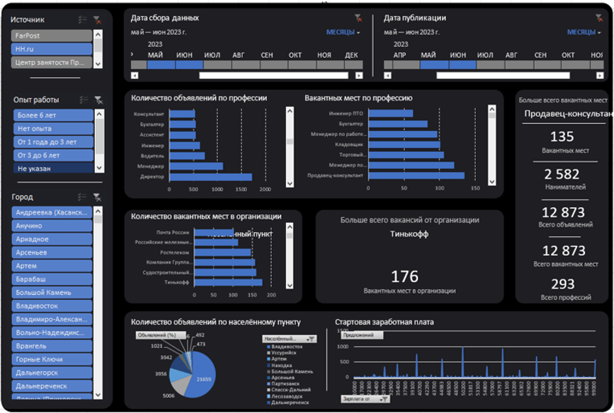

# 📊 Labor Market Analysis in Primorsky Krai

_Final project for the **«Digital Departments: Data Analytics»** program_  
_Case provided by the **Center for Advanced Vocational Training of Primorsky Krai (CAVT PK)**_

## 🧭 About the Project

This project presents a labor market analysis system for the Primorsky Krai.
The collected data is visualized using **Power BI** and **MS Excel** as interactive dashboards that allow users to:

- Assess demand for various professions
- Analyze employer requirements
- Track job distribution across localities
- Explore salary levels offered
- Identify the region’s most active employers

> The project was applied in practice and received positive feedback from industry professionals.
> A [recommendation letter](https://github.com/Bit-Maximum/RussiaJobData/blob/master/Translation/Media/Recomend.pdf) was issued by the CAVT of Primorsky Krai.

## ✨ Project Features

- 📥 Data collection from job websites: `hh.ru`, `farpost.ru`, `rabota.ru`
- 📊 Data processing in Excel
- 📈 Creation of interactive dashboards in Power BI and Excel
- 📁 Support for Excel import/export
- ⚙ Ability to update and merge with previous datasets

## 🛠 Stack

- **Programming Language:** Python
- **Libraries:** `requests`, `beautifulsoup4`, `selenium`, `pandas`
- **Visualization Tools:** Microsoft Power BI, Microsoft Excel
- **Data Formats:** `.xlsx`, `.pbix`

## 🖥 Installation & Launch

### 📦 Application Setup

1. Create a folder on your computer for the project
2. Download the latest version of `Сбор вакансий в Приморском крае.exe` from the [Releases](https://github.com/Bit-Maximum/RussiaJobData/releases)
3. Place the `.exe` file into this folder
4. (Optional) Place existing data in the file `Вакансии в Приморском крае.xlsx`
5. (Optional) Place dashboard files into the folder for automatic loading

### 📊 Initial Dashboard Configuration

#### Power BI:
1. Open `Дашборд_Вакансии_в_Приморском_крае.pbix`
2. Go to the **`Data` → `Advanced Options`** tab
3. Click **`Edit Query`**
4. Click the gear icon next to **`Source`** and specify the path to the file `Вакансии в Приморском крае.xlsx`
5. Click **`Close & Apply`**

#### Excel:
1. Open `Дашборд_Вакансии_в_Приморском_крае.xlsx`
2. Select the `Data` sheet
3. Go to **`Data` → `Edit Query`**
4. Specify the path to the file `Вакансии в Приморском крае.xlsx`
5. Save and refresh the tables

## 📸 Gallery

## 🏅 Achievements

- ✅ Successfully implemented in a real-world environment
- 📄 Received a [recommendation letter](https://github.com/Bit-Maximum/RussiaJobData/blob/master/Translation/Media/Recomend.pdf) from the CAVT of Primorsky Krai
- 🎓 Completed as a thesis project under the *«Digital Departments»* program

---

> This project remains relevant for regional labor market analysis.
> The repository serves both as a skills showcase and a foundation for future development.
